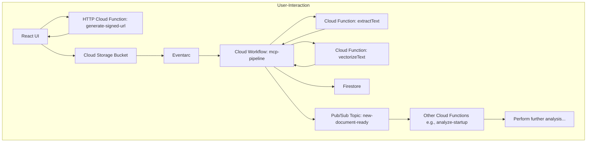

# AI Startup Evaluator - Data Ingestion Architecture

This document contains a diagram illustrating the event-driven data ingestion pipeline.

### Explanation of the Flow

1.  **Request Signed URL:** The React UI asks our `generate-signed-url` function for a secure URL to upload a file.
2.  **Upload File:** The UI uses the provided URL to upload the file directly and securely to a Cloud Storage bucket.
3.  **File Upload Event:** The new file in the bucket automatically creates an event.
4.  **Trigger Workflow:** Eventarc listens for this event and triggers our main Cloud Workflow.
5.  **Extract Text:** The workflow's first step is to call our specialized `extractText` function to get the raw text from the document.
6.  **Vectorize Text:** The workflow then passes this text to our `vectorizeText` function to get the semantic vector embedding.
7.  **Store Data:** The workflow takes the extracted text, the vector embedding, and other metadata and stores it all as a new document in Firestore.
8.  **Publish Notification:** Once the data is safely stored, the workflow publishes a message to a Pub/Sub topic. This message signals that a new document is ready for consumption.
9.  **Trigger Downstream Services:** Other services, like your existing `analyze-startup` function, can subscribe to this topic. They are triggered automatically when the message is published, allowing them to perform their own specific tasks with the newly processed data.