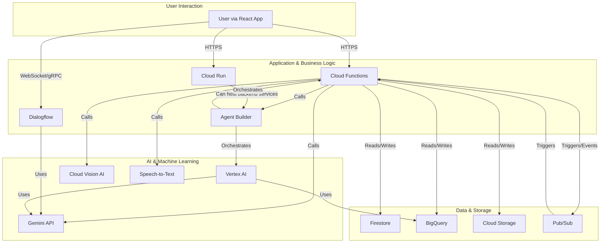

# GCP Architecture Diagram

This diagram shows the key Google Cloud Platform (GCP) services used in the AI-Powered Startup Analyst platform and how they are interconnected.

```mermaid
graph TD
    subgraph User Interaction
        A[User via React App]
    end

    subgraph Application & Business Logic
        B[Cloud Functions]
        C[Cloud Run]
        D[Agent Builder]
        E[Dialogflow]
    end

    subgraph AI & Machine Learning
        F[Gemini API]
        G[Vertex AI]
        H[Cloud Vision AI]
        I[Speech-to-Text]
    end

    subgraph Data & Storage
        J[Firestore]
        K[BigQuery]
        L[Cloud Storage]
        M[Pub/Sub]
    end

    A -- HTTPS --> B
    A -- HTTPS --> C
    A -- WebSocket/gRPC --> E

    B -- Triggers/Events --> M
    B -- Calls --> D
    B -- Calls --> F
    B -- Calls --> H
    B -- Calls --> I
    B -- Reads/Writes --> J
    B -- Reads/Writes --> K
    B -- Reads/Writes --> L

    C -- Can host backend services --> D

    D -- Orchestrates --> B
    D -- Orchestrates --> G

    E -- Uses --> F

    G -- Uses --> F
    G -- Uses --> K

    M -- Triggers --> B
```
