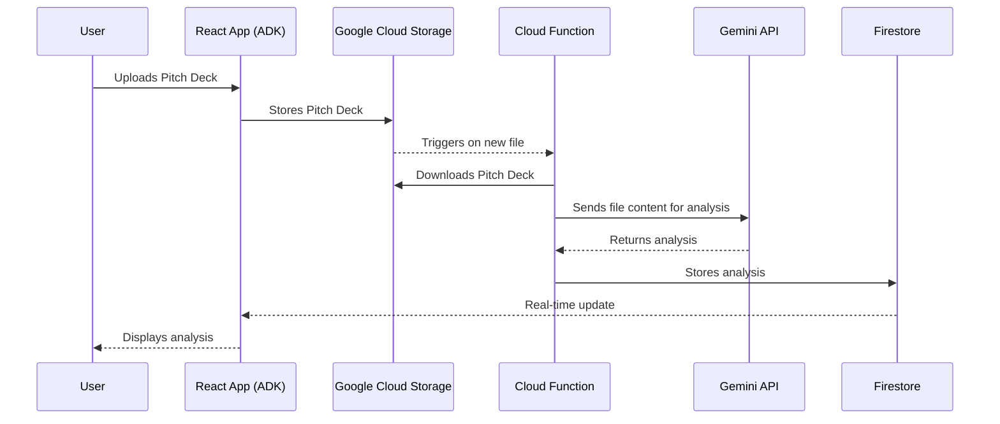

# UML Diagram (Text-based)

This document contains a text-based representation of the UML sequence diagram for the "Ingest and Analyze a Pitch Deck" use case. You can render this using a Mermaid diagram viewer.

