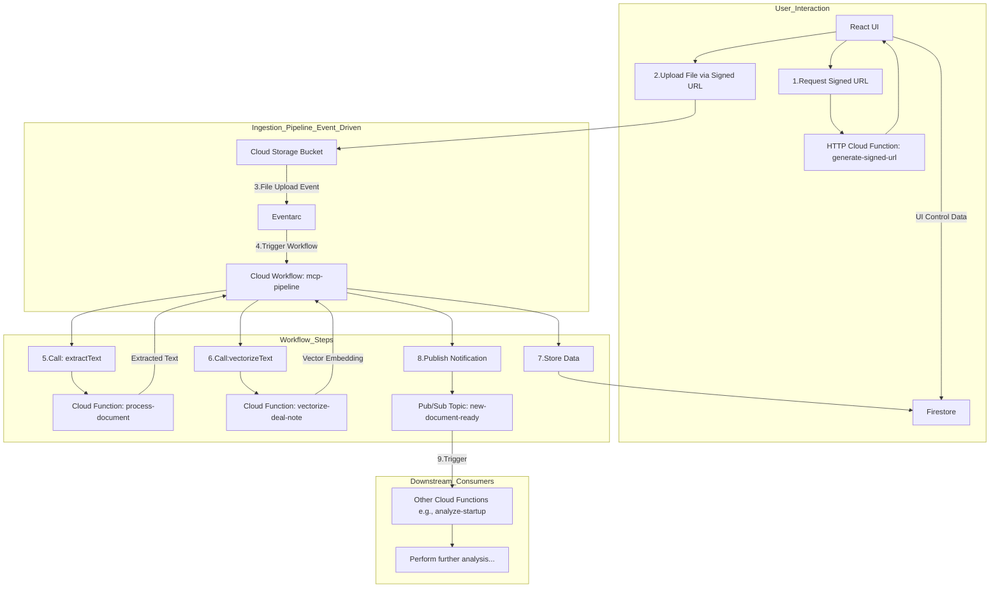

```mermaid

 flowchart TD
    subgraph User_Interaction
        A["React UI"] --> B["1.Request Signed URL"]
        B --> C["HTTP Cloud Function: generate-signed-url"]
        C --> A
        A --> D["2.Upload File via Signed URL"]
        A -- "UI Control Data" --> M
    end

    subgraph Ingestion_Pipeline_Event_Driven
        D --> E["Cloud Storage Bucket"]
        E -- "3.File Upload Event" --> F["Eventarc"]
        F -- "4.Trigger Workflow" --> G["Cloud Workflow: mcp-pipeline"]
    end

    subgraph Workflow_Steps
        G --> H["5.Call: extractText"]
        H --> I["Cloud Function: process-document"]
        I -- "Extracted Text" --> G
        G --> J["6.Call:vectorizeText"]
        J --> K["Cloud Function: vectorize-deal-note"]
        K -- "Vector Embedding" --> G
        G --> L["7.Store Data"]
        L --> M["Firestore"]
        G --> N["8.Publish Notification"]
        N --> O["Pub/Sub Topic: new-document-ready"]
    end

    subgraph Downstream_Consumers
        O -- "9.Trigger" --> P["Other Cloud Functions e.g., analyze-startup"]
        P --> Q["Perform further analysis..."]
    end 
```
