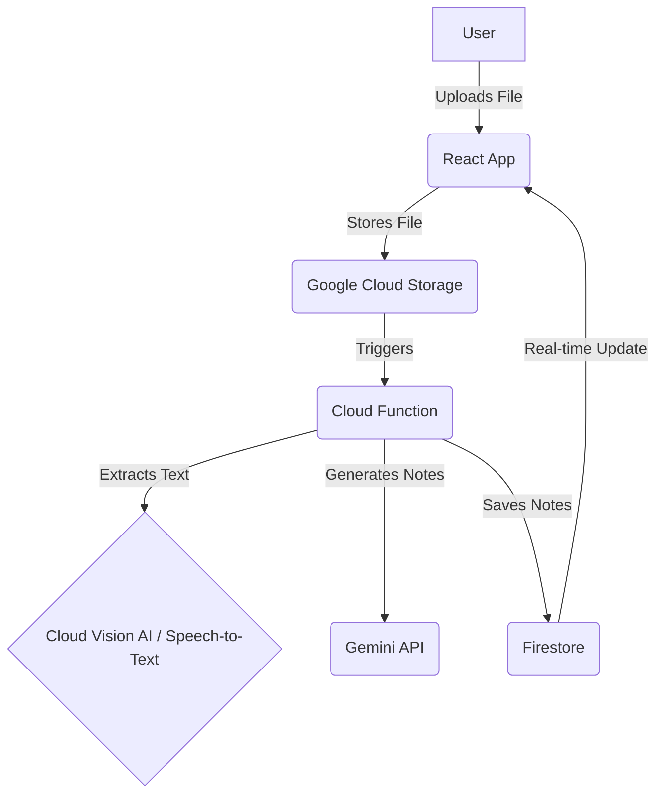
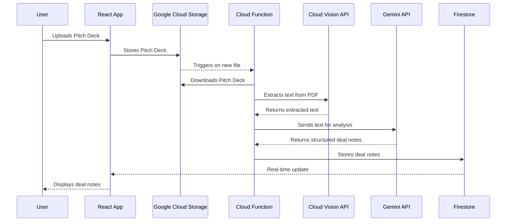

# Use Case 1: Document Upload and AI-Powered Analysis

## 1. Functionality

This use case covers the initial ingestion and analysis of startup documents. The user will be able to upload various file types (pitch decks, call transcripts, emails), and the system will automatically extract the text and generate structured deal notes.

## 2. GCP Architecture

## 3. UML Diagram

## 4. Low-Cost / Free Tier Strategy

*   **Cloud Functions:** The first 2 million invocations per month are free. This should be more than enough for development and early-stage use.
*   **Google Cloud Storage:** The first 5 GB-months of standard storage are free. You can also set up lifecycle rules to automatically move older files to cheaper storage classes like Nearline or Coldline.
*   **Cloud Vision AI:** The first 1,000 units per month are free for OCR. This is sufficient for processing a good number of pitch decks during development.
*   **Gemini API:** The free tier provides a generous number of requests per minute.
*   **Firestore:** The free tier includes 1 GiB of storage and 50,000 read/20,000 write operations per day.
