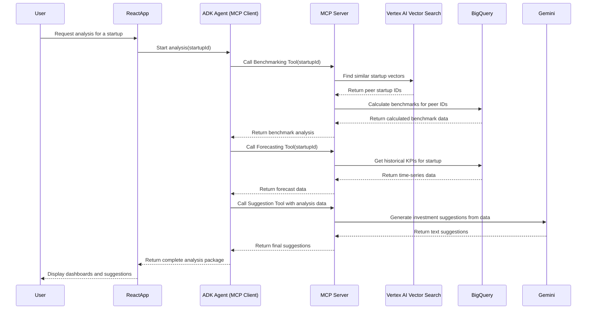

# Use Case 2: Hybrid AI-Analytics for Benchmarking and Forecasting

## 1. Functionality

This use case specifies a powerful and cost-effective hybrid architecture for startup analysis. It combines the strengths of AI-native services with powerful analytics engines.

First, **Vertex AI Vector Search** is used to perform a semantic search and identify a startup's true peer group based on deep similarity, not just industry tags. Then, **BigQuery** is used to perform fast and efficient benchmark calculations (averages, medians, etc.) on the KPI data of this AI-curated peer group. 

This approach ensures highly relevant, nuanced benchmarking while leveraging BigQuery's cost-effective analytical power. The framework also includes tools for forecasting and generating investment suggestions with Gemini, all exposed via a flexible **Model Context Protocol (MCP) server**.

## 2. GCP Hybrid Architecture

```mermaid
graph TD
    subgraph Data Ingestion & Vectorization
        A[Raw Data: Pitch Decks, Notes] -->|Stored in| B(Cloud Storage)
        B -->|Triggers| C[Cloud Function]
        C -->|Generates Embeddings| D(Vertex AI Embedding Model)
        D -->|Stores Vectors| E(Vertex AI Vector Search)
        A -->|Structured KPIs| F(BigQuery / Firestore)
    end

    subgraph Analysis & Serving
        G[User] --> H(React App)
        H -->|Initiates Analysis| I{ADK Agent (MCP Client)}
        I -->|Connects to| J[MCP Server on Cloud Run]
        
        subgraph MCP Tools
            J --> K(Benchmarking Tool)
            J --> L(Forecasting Tool)
            J --> M(Suggestion Tool)
        end

        K -->|1. Find Peer IDs| E
        K -->|2. Calculate Benchmarks| F
        L -->|Gets Historical KPIs| F
        M -->|Synthesizes Insights| N(Vertex AI - Gemini API)
    end

    I -->|Returns Final Analysis| H
```

## 3. UML Sequence Diagram

