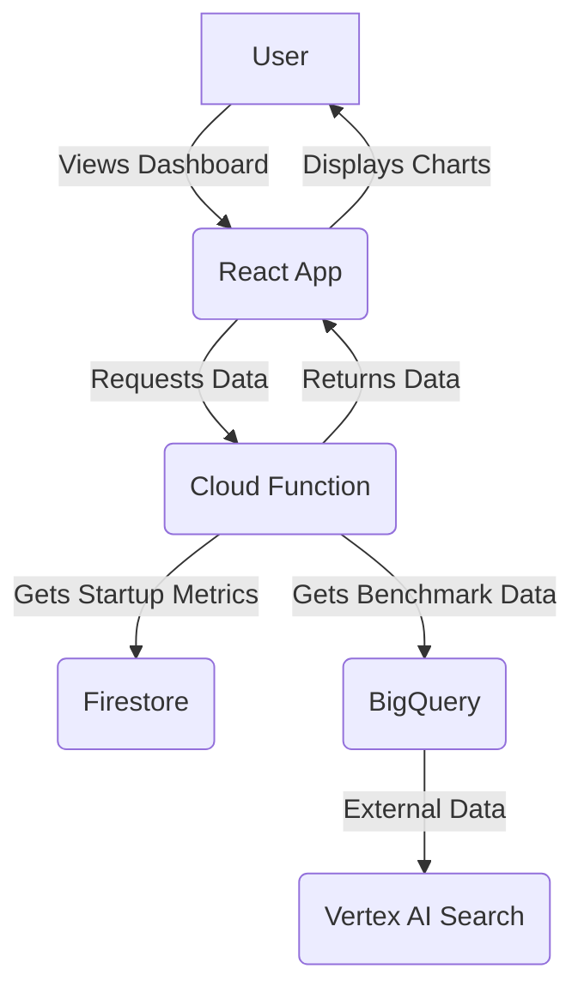
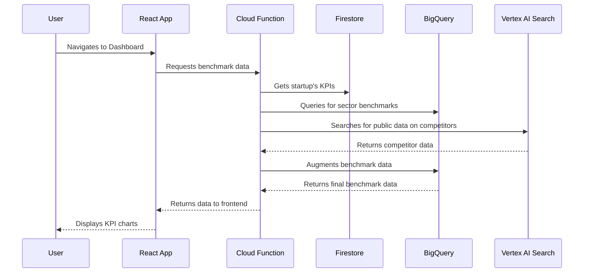

# Use Case 2: Dynamic KPI Metrics and Benchmarking

## 1. Functionality

This use case focuses on providing a comparative analysis of the startup. The system will display visual charts that benchmark the startup's key performance indicators (KPIs) against sector peers. This will help investors quickly understand how the startup is performing relative to the market.

## 2. GCP Architecture

## 3. UML Diagram

## 4. Low-Cost / Free Tier Strategy

*   **BigQuery:** The first 1 TB of queries per month is free. Structure your data and queries to minimize the amount of data scanned. You also get 10 GB of storage for free.
*   **Vertex AI Search:** Pricing is based on the number of queries and the size of the index. Start with a small index and a limited number of queries to keep costs low during development.
*   **Cloud Functions and Firestore:** Continue to leverage the free tiers as described in Use Case 1.
