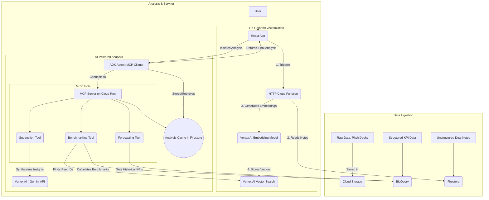
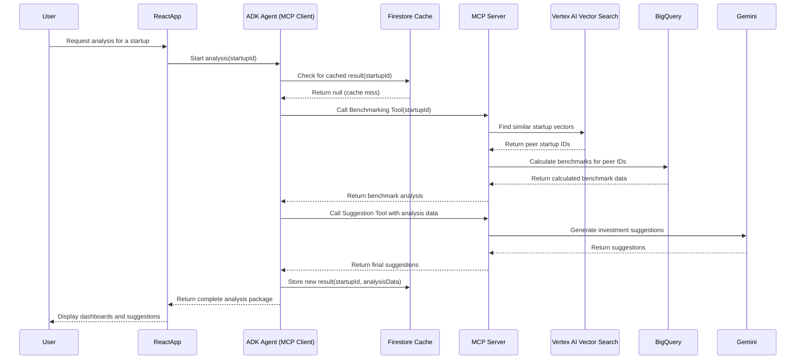

# Use Case 2: Hybrid AI-Analytics for Benchmarking and Forecasting

## 1. Functionality

This use case specifies a powerful and cost-effective hybrid architecture for startup analysis. It combines the strengths of AI-native services with powerful analytics engines.

First, **Vertex AI Vector Search** is used to perform a semantic search on unstructured deal notes (from Firestore) to find a startup's true peer group. Then, **BigQuery**, which stores structured KPI data (financials, hiring metrics, etc.), is used to perform fast and efficient benchmark calculations on that AI-curated peer group.

Vectorization of the deal notes is an **on-demand process** initiated from the UI. A user can choose to vectorize a single note or run a batch process to vectorize all historical notes. The final analysis capabilities are exposed via a flexible **Model Context Protocol (MCP) server**.

## 2. UI/UX Vision: The Analysis Workspace

To create a truly collaborative experience, the UI is designed as an `AnalysisWorkspace`, a unified, two-panel interface that mimics an analyst's workflow.

*   **Left Panel (Source Material):** This panel acts as the single source of truth, containing all ingested data for the startup. It features a tabbed `DocumentViewer` to display the original pitch deck, call transcripts, and the AI-generated structured `DealNotes`.

*   **Right Panel (AI Collaboration & Insights):** This is the interactive panel where the user guides the analysis and consumes the output. It contains:
    *   **Controls:** A dedicated area with toggles for analysis type (Semantic vs. Filtered), sliders for custom-weighting the importance of Team, Product, and Market, and the main "Analyze" button.
    *   **Collaborator Input:** A text area allowing the analyst to add specific questions or comments (e.g., "Focus on churn rate") to guide the AI's focus.
    *   **Tabbed Insights:** Once the analysis is run, this area presents the findings in clear, digestible tabs:
        *   **Summary & Recommendation:** The top-level summary and final investment recommendation.
        *   **Benchmarking:** Interactive charts comparing the startup to its peers. This section includes a "Show Peer Data" button that provides a curated table of the specific BigQuery data used for a given chart, ensuring transparency.
        *   **Risk Analysis:** A prioritized list of flagged risks and inconsistencies.

This design moves the application from a static dashboard to an interactive partner, allowing the user to direct the AI, verify its findings, and receive tailored, actionable insights.

## 3. GCP Hybrid Architecture

## 3. Cost Optimization Strategy

To ensure the platform is both powerful and low-cost, a multi-layered strategy is employed, focusing on aggressive caching and optimizing each high-cost service.

### Cost Drivers

*   **Vertex AI Embeddings + Vector Search:** Cost is driven by API calls for embedding, the size of the stored index, and the volume of search queries. Frequent re-embedding or queries can become expensive.
*   **BigQuery:** On-demand query pricing means that scanning large tables for each benchmark request can lead to high costs.
*   **Gemini API:** Costs are billed per token for both input and output. Generating detailed insights for every analysis can quickly add up.
*   **Firestore:** While cheaper than the other services, read/write operations can spike if the caching mechanism is not designed efficiently.
*   **Cloud Functions / Cloud Run:** Costs are based on execution time and the number of invocations. Long-running, synchronous jobs can inflate costs.

### Cost Optimization Techniques

#### 1. Embeddings + Vector Search
*   **Batching:** Process embeddings in batches rather than for each individual note to reduce API call overhead.
*   **Conditional Re-embedding:** Only re-embed a document when its source deal note actually changes.
*   **Cache Search Results:** Cache the top-k peer group results in Firestore to avoid hitting the Vector Search API for every single analysis request.

#### 2. BigQuery
*   **Partitioning:** Use partitioned tables (e.g., by date or industry) to avoid expensive full table scans.
*   **Materialized Views:** Pre-compute and store results for commonly requested KPIs and benchmarks.
*   **Caching:** Cache the final computed benchmarks in Firestore. BigQuery should only be queried on a cache miss or when a user explicitly requests a data refresh.

#### 3. Gemini API
*   **Token Limits:** Use concise, structured prompts and set limits on the number of output tokens to control costs.
*   **Conditional Calls:** Only call the Gemini API when new benchmarks are computed. Do not call it for requests that are served from the cache.
*   **Cache Insights:** Store the generated insights in Firestore with a Time-to-Live (TTL) policy (e.g., 1 week) to ensure freshness while minimizing redundant API calls.

#### 4. Firestore
*   **Aggregated Documents:** Store the entire analysis package (benchmarks + insights) in a single document to reduce the number of reads per request.
*   **TTL Policies:** Automatically purge old or stale cache data using Firestore's TTL feature to manage storage costs.

#### 5. Cloud Functions / Cloud Run
*   **Asynchronous Jobs:** Move heavy, long-running jobs like document embedding or large-scale BigQuery aggregations to asynchronous workflows using Pub/Sub and Cloud Run jobs. This prevents function timeouts and reduces costs associated with long execution times.

### Example Cost-Saving Flow

This flow ensures that the vast majority of user requests are fulfilled at a very low cost.

1.  A user requests an analysis for a startup.
2.  The system first performs a **Firestore cache check**.
3.  **If Cache Hit:** The cached result is returned instantly (costing only a single Firestore document read).
4.  **If Cache Miss:**
    *   The system triggers an **asynchronous, batch-oriented** process for embedding new notes.
    *   It queries **Vector Search** once to retrieve the peer group.
    *   It runs an optimized **BigQuery** query (using partitions/views) to minimize the data scanned.
    *   It generates insights via the **Gemini API** (with token caps).
    *   The final result is stored in the **Firestore cache**.
5.  All future requests for this startup are now served directly from the cache until it expires or is explicitly refreshed.

## 4. Security and Best Practices

To ensure the platform is secure, several best practices are implemented at no additional cost.

*   **Principle of Least Privilege (IAM):** Each service (Cloud Function, Cloud Run) is granted the minimum set of permissions required for it to function. This is achieved by using dedicated service accounts with fine-grained IAM roles, preventing any single service from having excessive access.

*   **Secure Endpoints:** All HTTP-triggered services, including the MCP Server on Cloud Run and any HTTP Cloud Functions, are configured to require authentication. This prevents unauthorized public access and ensures that only legitimate requests from the application frontend are processed.

*   **Secret Management:** Sensitive information, such as the Gemini API Key, is stored securely in **Google Cloud Secret Manager**. The services are granted permission to access specific secrets at runtime, which is significantly more secure than storing them in environment variables or source code. This falls within Secret Manager's generous free tier.

*   **Source Code Safety:** The project's `.gitignore` file is configured to explicitly ignore sensitive files like `terraform.tfvars` or files containing API keys, preventing them from being accidentally committed to the repository.

## 5. UML Sequence Diagram

This diagram shows the flow for a **cache miss**, where a full recalculation is needed.

