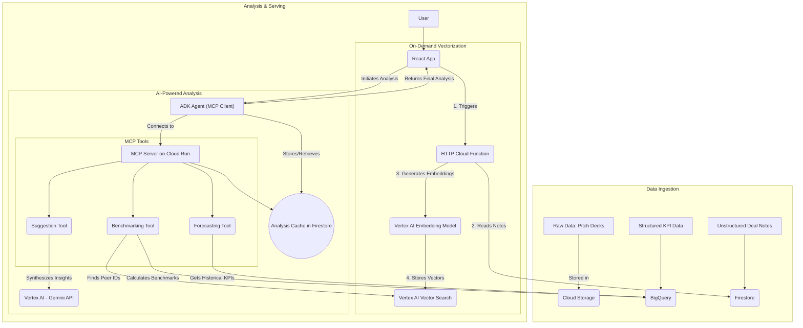
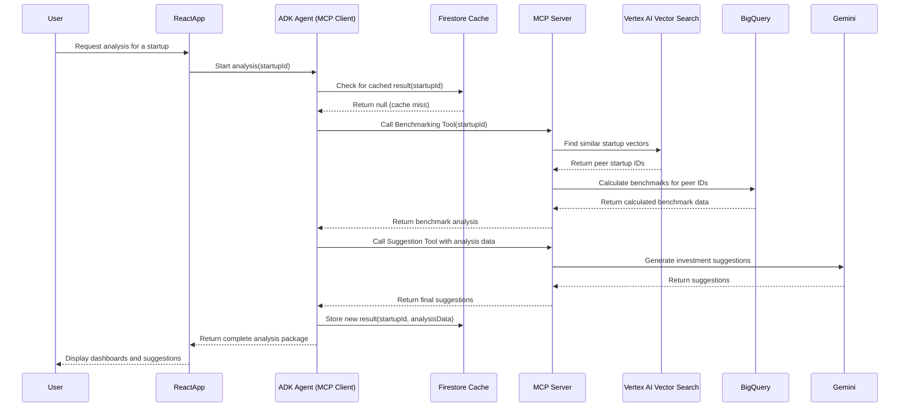

# Use Case 2: Hybrid AI-Analytics for Benchmarking and Forecasting

## 1. Functionality

This use case specifies a powerful and cost-effective hybrid architecture for startup analysis. It combines the strengths of AI-native services with powerful analytics engines.

First, **Vertex AI Vector Search** is used to perform a semantic search on unstructured deal notes (from Firestore) to find a startup's true peer group. Then, **BigQuery**, which stores structured KPI data (financials, hiring metrics, etc.), is used to perform fast and efficient benchmark calculations on that AI-curated peer group.

Vectorization of the deal notes is an **on-demand process** initiated from the UI. A user can choose to vectorize a single note or run a batch process to vectorize all historical notes. The final analysis capabilities are exposed via a flexible **Model Context Protocol (MCP) server**.

## 2. GCP Hybrid Architecture

## 3. Cost Optimization

To ensure the platform is both powerful and low-cost, a caching strategy is essential:

*   **Analysis Caching:** The final output of an analysis (benchmarks, risk flags, suggestions) is stored in a dedicated Firestore document. When a user views a startup, the UI first attempts to load this cached result, which is extremely fast and inexpensive.
*   **On-Demand Recalculation:** The expensive, full analysis pipeline (involving Vector Search, BigQuery, and Gemini) is only triggered if no cached result exists or if the user explicitly requests a refresh. This dramatically reduces API calls and query costs for routine dashboard views.
*   **Data Segregation:** Storing structured KPI data in BigQuery is optimal for analytical queries, while unstructured notes are kept in Firestore. This ensures the right database is used for the right job, optimizing both cost and performance.

## 4. UML Sequence Diagram

This diagram shows the flow for a **cache miss**, where a full recalculation is needed.

