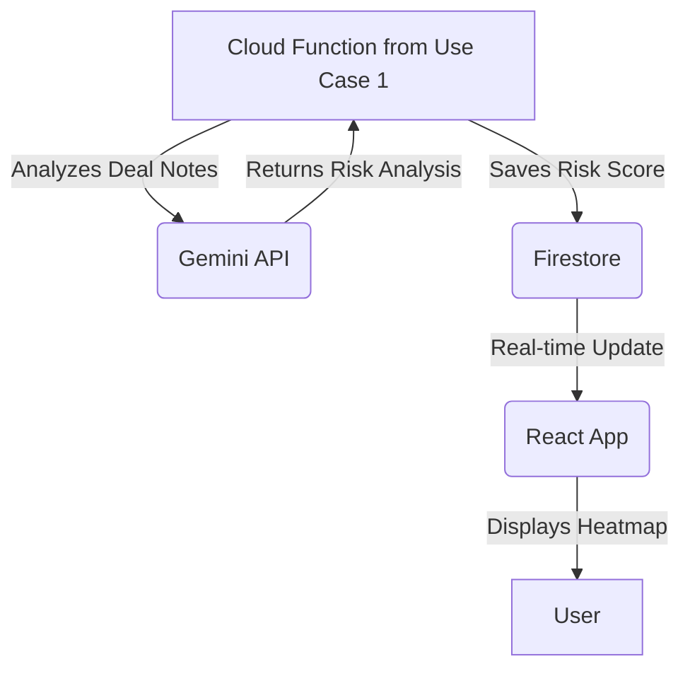
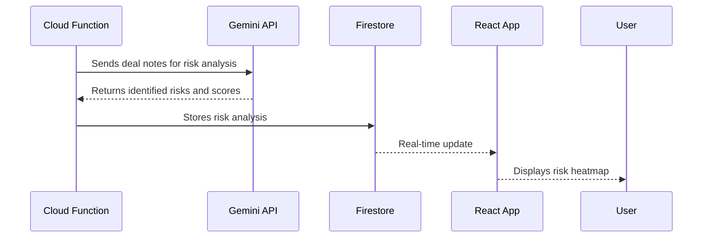

# Use Case 3: Risk Heatmap and Scoring

## 1. Functionality

This use case is about identifying and visualizing potential risks. The system will analyze the structured deal notes to flag inconsistencies, inflated market size, or unusual churn patterns. The identified risks will be displayed in an intuitive heatmap format, with a corresponding risk score.

## 2. GCP Architecture

## 3. UML Diagram

## 4. Low-Cost / Free Tier Strategy

*   **Gemini API:** Continue to use the free tier for development and testing.
*   **Cloud Functions and Firestore:** The cost will be minimal, as this function will be triggered as part of the main analysis workflow. The additional storage in Firestore will be negligible.
