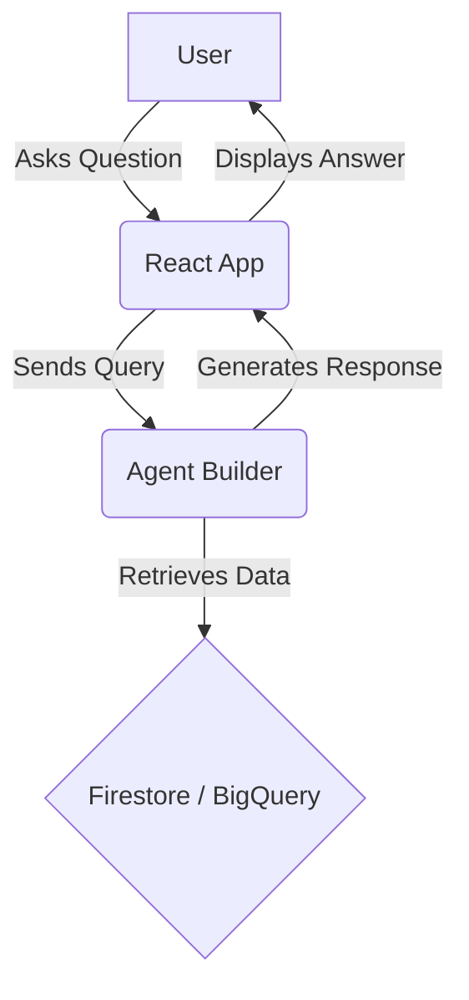
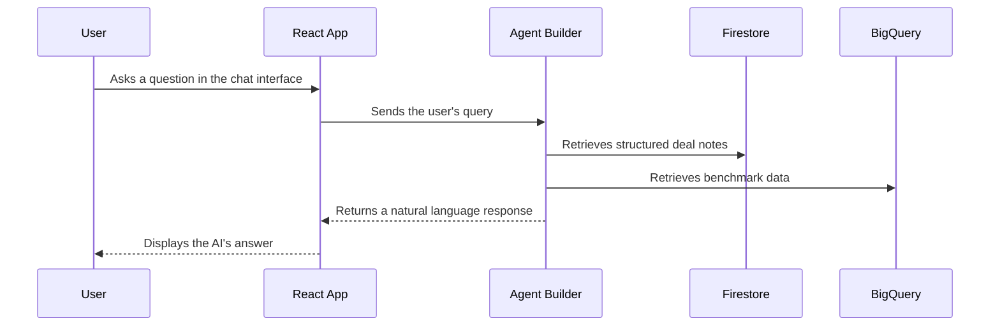

# Use Case 4: Interactive AI Assistant

## 1. Functionality

This use case provides an interactive way for investors to delve deeper into the analysis. Users can ask natural language questions about the startup, and the AI assistant will provide answers based on the available data. This allows for a more dynamic and exploratory analysis process.

## 2. GCP Architecture

## 3. UML Diagram

## 4. Low-Cost / Free Tier Strategy

*   **Agent Builder:** The free tier provides a generous number of requests per month, which should be sufficient for most development and testing needs.
*   **Firestore and BigQuery:** The cost will depend on the number of queries made by the agent. However, since the agent will be querying data that is already stored, the additional cost should be minimal.
