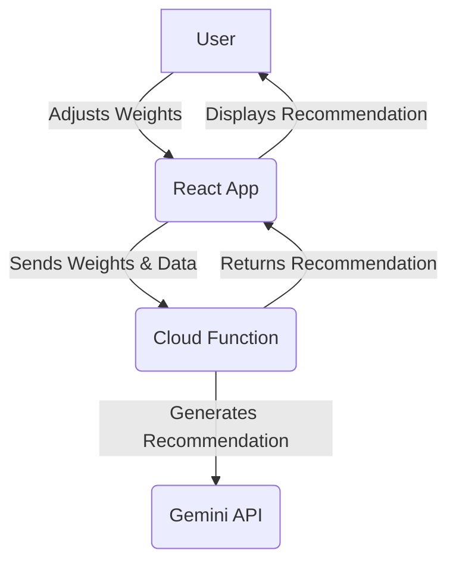
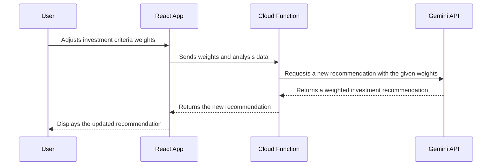

# Use Case 5: Scenario Comparison and Recommendation Engine

## 1. Functionality

This use case allows investors to tailor the investment recommendation to their specific preferences. Users can adjust the weightages of different evaluation criteria (e.g., team, product, market), and the system will generate a new recommendation based on the updated weights. This allows for a more personalized and transparent decision-making process.

## 2. GCP Architecture

## 3. UML Diagram

## 4. Low-Cost / Free Tier Strategy

*   **Gemini API:** Continue to use the free tier for development and testing.
*   **Cloud Functions:** The cost will be minimal, as this function will only be triggered when the user changes the weightages.
